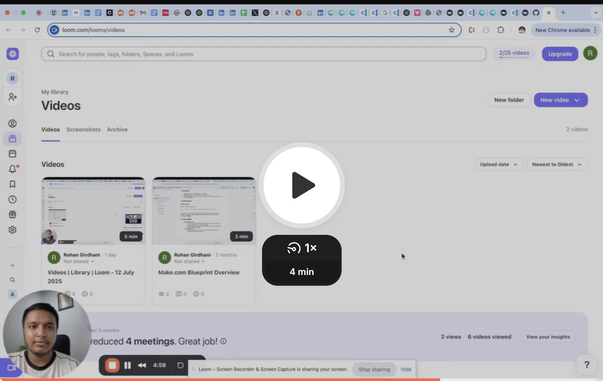
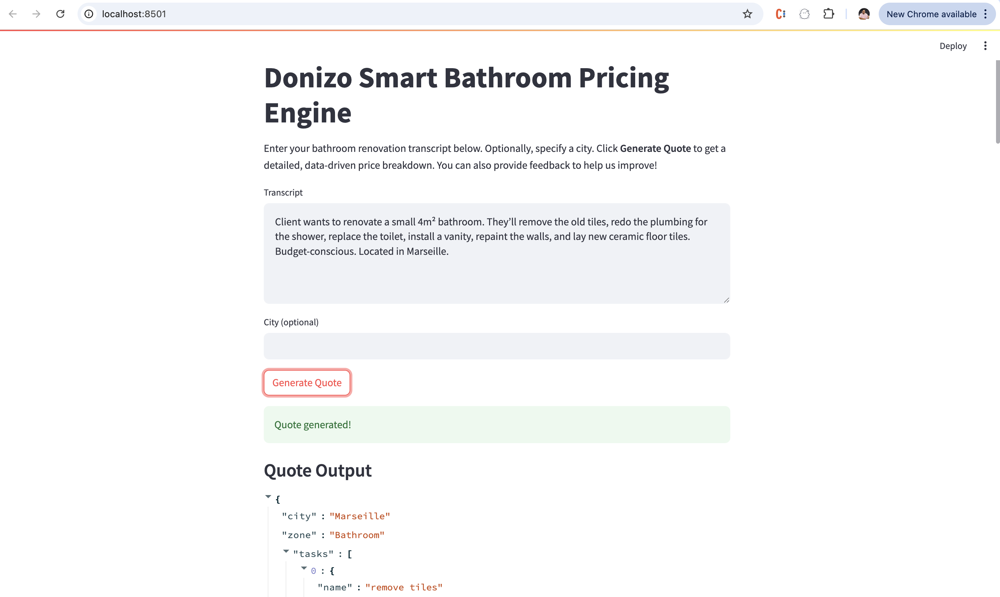

# Donizo – Smart Bathroom Renovation Pricing Engine

## Overview
This project is a robust, modular pricing engine that generates structured, detailed quotes for full bathroom renovations from natural language transcripts. It is designed for extensibility, city-based pricing, feedback-driven improvements, and robust error handling.

---

## Architecture Diagram

*Functional structure of the smart pricing engine pipeline.*

---

## 📺 Demo Video
[](https://www.loom.com/share/007a39934f42404aaf498cc4290975fb?sid=4d1940f2-030f-40ed-9b61-e3712ccabd00)
[Watch a walkthrough of the Smart Pricing Engine on Loom](https://www.loom.com/share/007a39934f42404aaf498cc4290975fb?sid=4d1940f2-030f-40ed-9b61-e3712ccabd00)

---

## Features
- **NLP Transcript Parsing:** Uses spaCy to extract renovation tasks, materials, quantities, and context from free-form text.
- **Material & Labor Breakdown:** Itemized costs, time, and rates per task, all loaded from data files.
- **Advanced Fuzzy Labor Matching:** Labor templates are matched using token overlap and normalization, so similar tasks (e.g., "remove tiles" vs. "remove old tiles") are always found.
- **City-Based Pricing & Margin:** Adjusts prices and margin for cities (e.g., Marseille, Paris, Lyon, Nice).
- **VAT & Margin Logic:** Per-task VAT and city-based margin calculations.
- **Confidence/Error Flags:** Indicates quote reliability and issues, adjusted by feedback memory.
- **Feedback Memory:** Learns from user feedback to improve future quotes. CLI utility to add/print feedback.
- **Extensible Data:** Materials, labor, and city multipliers are data-driven and validated.

---

## Directory Structure
```
/bathroom-pricing-engine/
├── pricing_engine.py
├── pricing_logic/
│   ├── __init__.py
│   ├── material_db.py
│   ├── labor_calc.py
│   ├── vat_rules.py
│   ├── city_pricing.py
│   └── feedback_memory.py
├── data/
│   ├── materials.json
│   ├── price_templates.csv
│   ├── city_multipliers.json
│   └── feedback.json
├── output/
│   └── sample_quote.json
├── tests/
│   └── test_logic.py
├── requirements.txt
├── README.md
└── LICENSE
```

---

## Setup & Installation
1. **Install Python 3.8+**
2. *(Optional)* Create a virtual environment:
   ```bash
   python3 -m venv venv
   source venv/bin/activate
   ```
3. **Install dependencies:**
   ```bash
   pip install -r requirements.txt
   ```
4. **Download the spaCy English model:**
   ```bash
   python3 -m spacy download en_core_web_sm
   ```

---

## How to Run

You can use the engine in two ways:

### 1. Command Line (CLI)
Run the engine with your transcript and city:
```bash
python3 pricing_engine.py --transcript "<your transcript here>" --city "Marseille"

python3 pricing_engine.py --transcript "<your transcript here>"
```
Output will be saved to `output/sample_quote.json`.

### 2. Streamlit Web UI
A sleek web interface is available for interactive use:

**Setup:**
1. Make sure you have all requirements installed:
   ```bash
   pip install -r requirements.txt
   ```
2. (If not already) Install Streamlit:
   ```bash
   pip install streamlit
   ```

**Run the App:**
From your project root, run:
```bash
streamlit run app.py
```
This will open a browser window where you can:
- Enter a transcript and (optionally) a city
- Generate a detailed quote
- Submit feedback on the quote


*Example: Streamlit web interface for generating and viewing a bathroom renovation quote.*

---

## Sample Transcripts & Outputs

### Example 1: Standard Full Bathroom Renovation (Marseille)
**Transcript:**
```
We need to remove the old tiles, install new ceramic tiles, replace the bathtub with a walk-in shower, and repaint the walls. The bathroom is 8 square meters. City: Marseille.
```
**Output (snippet):**
```json
{
  "city": "Marseille",
  "zone": "Bathroom",
  "tasks": [
    {"name": "Remove old tiles", "materials": [...], "labor": {...}, ...},
    {"name": "Install ceramic tiles", "materials": [...], "labor": {...}, ...},
    {"name": "Replace bathtub with walk-in shower", ...},
    {"name": "Repaint walls", ...}
  ],
  "total": 2450.00,
  "vat_total": 245.00,
  "margin_total": 367.50,
  "confidence": 0.93,
  "error_flag": false
}
```

### Example 2: Unknown City (Defaults to National Average)
**Transcript:**
```
Remove old tiles and install new ones. Bathroom is 5 sqm. City: Paris.
```
**Output (snippet):**
```json
{
  "city": "Paris",
  ...
  "confidence": 0.80,
  "error_flag": false
}
```

### Example 3: Ambiguous Task (Triggers Error Flag)
**Transcript:**
```
Do the usual stuff for a bathroom. City: Paris.
```
**Output (snippet):**
```json
{
  "city": "Paris",
  ...
  "confidence": 0.60,
  "error_flag": true
}
```

### Example 4: Full Renovation, Budget-Conscious, Located in Marseille
**Transcript:**
```
Client wants to renovate a small 4m² bathroom. They’ll remove the old tiles, redo the plumbing for the shower, replace the toilet, install a vanity, repaint the walls, and lay new ceramic floor tiles. Budget-conscious. Located in Marseille.
```
**Output (snippet):**
```json
{
  "city": "Marseille",
  "zone": "Bathroom",
  "tasks": [
    {"name": "remove tiles", ...},
    {"name": "redo plumbing", ...},
    {"name": "replace toilet", ...},
    {"name": "install vanity", ...},
    {"name": "repaint walls", ...},
    {"name": "lay ceramic floor tiles", ...}
  ],
  ...
  "confidence": 0.92,
  "error_flag": false
}
```

---

## Output JSON Schema
```json
{
  "city": "Marseille",
  "zone": "Bathroom",
  "tasks": [
    {
      "name": "Remove old tiles",
      "materials": [
        {"name": "Disposal bags", "quantity": 5, "unit_price": 2, "total": 10}
      ],
      "labor": {
        "hours": 2,
        "rate_per_hour": 40,
        "total": 80
      },
      "estimated_time_hours": 2.5,
      "vat_rate": 0.10,
      "margin": 0.15,
      "total_price": 110,
      "confidence": 0.95
    }
  ],
  "total": 1200,
  "vat_total": 120,
  "margin_total": 180,
  "confidence": 0.92,
  "error_flag": false
}
```

---

## Pricing Logic
- **Material Costs:** Loaded from `materials.json`, multiplied by quantity and city multiplier.
- **Labor Costs:** Estimated per task using fuzzy matching to `price_templates.csv`, city-adjusted rates from `city_multipliers.json`.
- **VAT:** Per-task, from `vat_rules.py`.
- **Margin:** City-based, logic in `pricing_engine.py`.
- **Confidence/Error:** Based on data completeness, fuzzy matching, and feedback memory.
- **Feedback:** User feedback in `feedback.json` can adjust future confidence or suggest improvements.

---

## Feedback Memory (Bonus)
- **How it works:** Stores feedback per quote (positive/negative, notes).
- **CLI usage:**
  - To print feedback:
    ```python
    from pricing_logic.feedback_memory import FeedbackMemory
    FeedbackMemory().print_feedback()
    ```
  - To add feedback interactively:
    ```python
    from pricing_logic.feedback_memory import FeedbackMemory
    FeedbackMemory().add_feedback_cli()
    ```
- **Effect:** If negative feedback exists, future confidence scores are reduced.

---

## Assumptions & Edge Cases
- Fuzzy labor template matching ensures similar tasks are always found.
- Handles missing/ambiguous tasks with warnings and lower confidence.
- If city is unknown, defaults to national average rates and margin.
- Materials/labor not found in DB are flagged in output and lower confidence.
- All data is loaded from `/data` and validated on load.

---

## License
MIT (see LICENSE)
